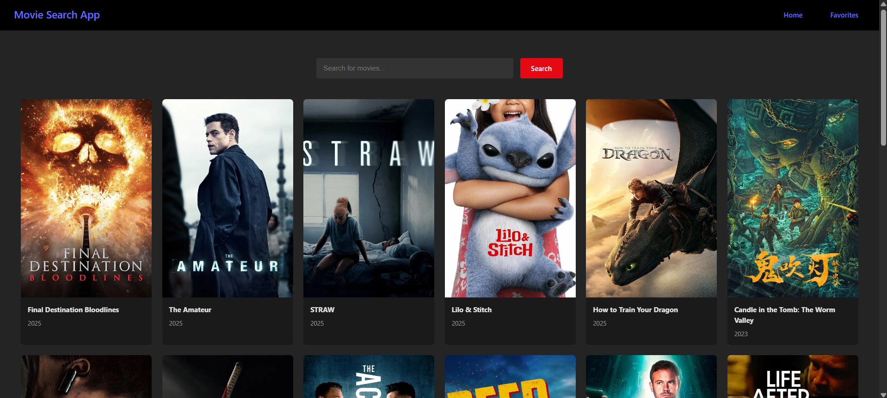
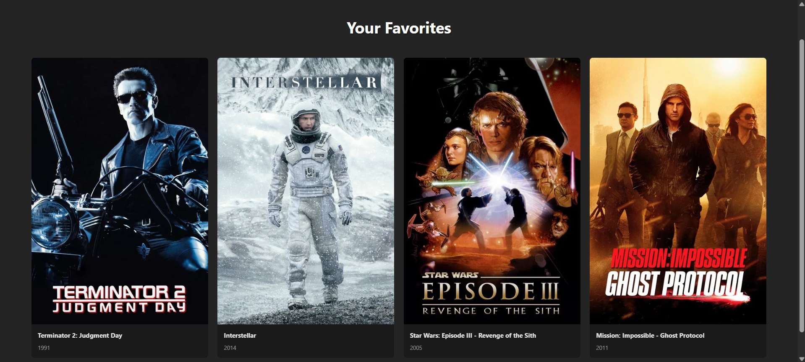

# 🎬 Movie Search App

A React-based movie search and favorites app powered by the [TMDB (The Movie Database) API](https://www.themoviedb.org/). Users can search for movies and add favorites—stored locally in the browser.

## 🌐 Live Demo

Check out the live app here:  
🔗 **[movie-search-react-2025.netlify.app](https://movie-search-react-2025.netlify.app/)**

## 🚀 Features

- 🌟 View trending/popular movies
- 🔍 Search for movies using TMDB API
- ❤️ Mark/unmark movies as favorites
- 💾 Favorites are saved in `localStorage`
- 🔁 Responsive and user-friendly interface

## 📸 Preview




## 🛠️ Tech Stack

- **React**
- **React Router**
- **Context API** (for managing favorites)
- **TMDB API**
- **Vite**
- **CSS Modules / Custom CSS**

## 📦 Installation & Running Locally

1. **Clone the repository**

```bash
git clone https://github.com/your-username/movie-search-app.git
cd movie-search-app
```

2. **Install dependencies**

```bash
npm install
```

3. **Set up environment variables**

Create a `.env` file in the root directory with the following content:

```bash
VITE_TMDB_API_KEY=your_tmdb_api_key_here
```

4. **Run the development server**

```bash
npm run dev
```